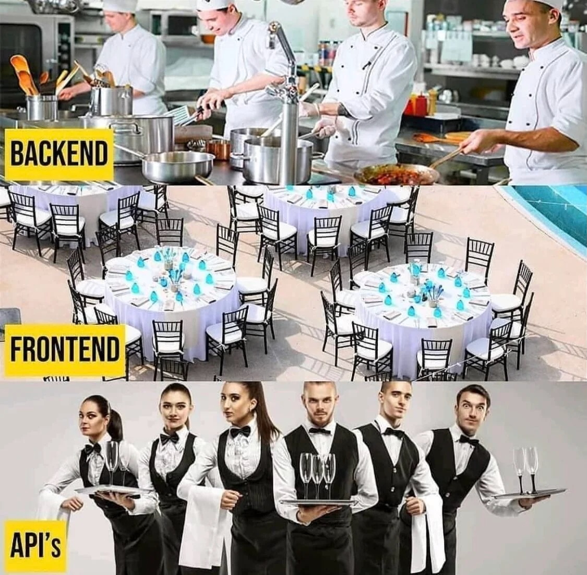

💭 **Why You're Here**
<!-- newlines: 2 -->
<!-- pause -->
1. Because engineers use words like **“instance”, “foreign key”, "related objects"** etc.
<!-- newline -->
<!-- pause -->
2. Understand what is **"Server"**, **"Database"**, **"API"**, **"RESTFul"**, **"CRUD"** etc.  
<!-- newline -->
<!-- pause -->
3. **Who/What is Jason?** 🤔
<!-- newline -->
<!-- pause -->
4. ??? (You tell me!)  
<!-- pause -->
<!-- jump_to_middle -->
📜 **Ground Rules**
<!-- newlines: 2 -->
<!-- pause -->
1. Be **respectful.** 🤝
<!-- newline -->
<!-- pause -->
2. Ask **questions!** 🙋🏽‍♂️🙋🏽‍♀️ (To Me or to your peers.)  
<!-- newline -->
<!-- pause -->
3. **Don’t be shy.** 😊  
<!-- newline -->
<!-- pause -->
4. **Answer** a question!. 😀  
<!-- newline -->
<!-- pause -->
5. **Relax.** 😌

<!-- end_slide -->

👉 Let's practice the **Ground Rules** first
<!-- newlines: 2 -->
<!-- pause -->
- 🧘🏻 Relax!  
<!-- newline -->
<!-- pause -->
- 😈 Now I will ask **Questions!!**  
<!-- newline -->
<!-- pause -->
- 🙋🏽 And You will **Answer!!**  

<!-- end_slide -->

❓ **Trivia Questions**
<!-- newlines: 2 -->
<!-- pause -->
1. **why_write_in_this_strange_way ?** 🤯  
<!-- newline -->
<!-- pause -->
  - Most programming languages don’t allow variable, method, class, etc to contain spaces.
<!-- newlines: 2 -->
<!-- pause -->
2. **What is this style of writing called?**
<!-- newline -->
<!-- pause -->
  - snake_case 🐍
<!-- newlines: 2 -->
<!-- pause -->
3. **Do you know any other such Letter cases used in programming?**  
<!-- newline -->
<!-- pause -->
  - 🐍 **snake_case**: Variables (Python, Ruby).
<!-- pause -->
  - 🐫 **camelCase**: Functions (JavaScript, TypeScript).
<!-- pause -->
  - **PascalCase**: Classes (Python, JavaScript).
<!-- pause -->
  - 🍢 **kebab-case**: File names, URLs, Git branches etc.
<!-- pause -->
  - **SCREAMING_SNAKE_CASE**: Constants, enums, environment variables, etc.
<!-- newlines: 2 -->
<!-- pause -->
4. **Why do software engineers the Dark Mode?**  
<!-- newline -->
<!-- pause -->
  - 👁️ Reduces eye strain (Less blue light = fewer headaches).
<!-- pause -->
  - 🔋 Saves battery (Black pixels = power savings).
<!-- pause -->
  - **😎 It just looks cool 😎**. 

<!-- end_slide -->

👨🏽‍💻  **Client** vs **Server**
<!-- newlines: 2 -->
<!-- pause -->
-> **Client** aka **Frontend**
<!-- pause -->
- What users see and interact with directly (UI/UX).  
- HTML, CSS, and JavaScript (React, Angular, Vue, etc.).  
- Website, Mobile app, etc.  
<!-- newline -->
<!-- pause -->
-> **Server** aka **Backend**
<!-- pause -->
- What users don’t see directly. The Engine under the hood.  
- Handles all the logic and data storage.  
- Application : Python, Ruby, Java, Node.js, etc.  
- Storage : Database, File System, etc.  
<!-- pause -->
<!-- end_slide -->
<!-- newlines: 4 -->


<!-- end_slide -->


📡  **API** vs **WebSocket** vs **SSE**
<!-- newlines: 2 -->
<!-- pause -->
-> **API**
<!-- pause -->
- The most common interface between Client and Server (via HTTP).  
- Client makes **requests** to the Server. Server replies with a **response**.  
- HTTP Request methods : POST, GET, PUT, PATCH, DELETE.  
- Corresponding actions : Create, Read, Update, Delete (CRUD).  
- Request/Response Body : Form-data, JSON, XML, Binary, File etc.  
<!-- newline -->
<!-- pause -->
-> **WebSocket**
<!-- pause -->
- A two-way, real-time communication channel between Client and Server.  
- Client and Server establish a **persistent connection**.  
- Both can send messages to each other **anytime**.  
- Use Case: Chat apps, Notification, Online Gaming, etc.  
<!-- newline -->
<!-- pause -->
-> **Server-Sent Events (SSE)**
<!-- pause -->
- A one-way, real-time communication channel from Server to Client.  
- Like WebSocket, Client and Server establish a **persistent connection**.  
- But here only the Server sends updates to the Client **automatically**.  
- Use Case: Live Stock price, Progress Bar, Realtime Updates, etc.  

<!-- end_slide -->

🗄️ **Database** vs **Storage** vs **Cache**
<!-- newlines: 2 -->
<!-- pause -->
-> **Database**
<!-- pause -->
- A structured way to store and manage data (users, products, orders).  
- **Relational (SQL):** (MySQL, PostgreSQL, SQLite).  
  - Data is organized into tables (rows and columns).  
  - Use Case: User profiles, orders, inventory, etc.  
- **Non-Relational (NoSQL):** (MongoDB, DocumentDB, Cassandra).  
  - Data is stored in flexible formats (JSON, XML, etc).  
  - Use Case: Social media posts, analytics, notes etc.  
<!-- newline -->
<!-- pause -->
-> **Storage**
<!-- pause -->
- A place to store files (e.g., images, videos, documents).  
- **Files** are stored as-is (no structure).  
- User can upload, download, or delete files.  
- Use Case: Storing PDFs, photos, videos, music, etc.  
<!-- newline -->
<!-- pause -->
-> **Cache**
<!-- pause -->
- A temporary storage for frequently accessed data.  
- Data is stored in memory (super fast to access).  
- Expires after a certain set time or when the data changes.  
- Use Case: Storing user session, heavy calculations, etc.  

<!-- end_slide -->
🧩 **Objects & Instances**
<!-- newlines: 2 -->
<!-- pause -->
-> **Object**
<!-- pause -->
- A template of something (e.g., "User" with name, email).
<!-- newline -->
<!-- pause -->
-> **Instance**
<!-- pause -->
- A specific copy created from the template (e.g., "John Wick, john@wick.com").
<!-- newline -->
<!-- pause -->
-> **Database Table**  
<!-- pause -->
How the data is stored in database (SQL)

| UserID | Name     | Email         |
|--------|----------|---------------|
| 1      | John     | john@wick.com |
| 2      | Bob      | bob@smith.com |

<!-- end_slide -->

🔗 **ForeignKey & Related Objects**
<!-- newlines: 2 -->
<!-- pause -->
-> **ForeignKey** aka **ManyToOne**
<!-- pause -->
- When one table has a column that references another table.
- Many objects may be related to one. (e.g., User has many Orders).
<!-- newline -->
<!-- pause -->
-> **Related Objects**
<!-- pause -->
- The objects that are related to the main object.
- (e.g., User has many Orders, so Orders are related to User).
<!-- newline -->
<!-- pause -->
-> **Example**
<!-- pause -->
| OrderID | UserID (ForeignKey) |
|---------|---------------------|
| 101     | 1                   |
| 102     | 2                   |
| 103     | 2                   |

<!-- end_slide -->
🤔 **Questions?**
<!-- newline -->
<!-- pause -->
```json
{
  "date": "2025-02-12",
  "products": [
    {
      "name": "iPhone 16 Pro Max",
      "price": 1499.99,
      "description": "The latest iPhone with a 12MP camera and 5G support"
    },
    {
      "name": "AirPods Pro",
      "price": 449.99,
      "description": "The best wireless earbuds with active noise cancellation"
    }
  ],
  "first_name": "John",
  "last_name": "Wick",
  "email": "john@wick.com",
  "phone": "555-123-4567",
  "payment method": "gold_coin",
}
```
<!-- newline -->
-> What is that, Is it written correctly ⁉️
<!-- pause -->
-> Can you imagine how this would be stored in the **Database** ⁉️

<!-- end_slide -->

<!-- jump_to_middle -->
<!-- column_layout: [1, 1, 1] -->
<!-- column: 1 -->
Thank you!
<!-- newlines: 2 -->
